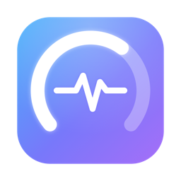

<div align="center">



# Auspex

**A lightweight, beautiful macOS menu bar monitor for your system's vital signs.**

Disk · RAM · CPU · Network · Battery · Temperatures — at a glance, with a glassy native UI.


</div>

---

Auspex lives in your menu bar. Click the pulse icon for a live, glassy panel of everything
your Mac is doing right now. It's native SwiftUI, uses only built-in macOS APIs (zero
third-party dependencies), and idles at roughly **0.5% CPU**.

> In ancient Rome, an *auspex* read the signs to divine the state of things. This one reads
> your Mac's.

## Screenshots

<!-- Add your own captures to docs/ and uncomment:

-->

_Tip: drop a panel screenshot at `docs/panel.png` and uncomment the line above to show it here._

## Features

- **CPU** — overall load ring, per-core bars (Performance/Efficiency labeled), and a load sparkline.
- **Memory** — used / wired / compressed, with live memory-pressure color (green → yellow → red).
- **Storage** — every mounted volume incl. external drives; free space matches Finder.
- **Network** — live up/down throughput with trend sparklines and session totals.
- **Battery** — charge, charging state, health %, and cycle count (laptops only).
- **Temperatures** — on-die sensors plus the system thermal state.
- **Custom menu bar mark** with an optional inline CPU/RAM %.
- **Animated, glassy UI** — Liquid Glass cards, glowing rings, rounded type; tuned for light & dark.
- **Frugal** — one shared timer; fast updates while open, a slow tick while closed, and it pauses entirely if you hide the inline stat.
- **Open at login** via `SMAppService`.

## Requirements

- **macOS 26 (Tahoe) or later** — the UI uses the system Liquid Glass APIs.
- **Apple Silicon** (arm64).
- To build: **Xcode 26+** and [XcodeGen](https://github.com/yonaskolb/XcodeGen) (`brew install xcodegen`).

## Install

### Option A — Download (no Xcode needed)

1. Grab `Auspex-<version>.zip` from the [**Releases**](../../releases) page and unzip it.
2. Move **Auspex.app** to your `/Applications` folder.
3. Because the app is open-source and **not signed with a paid Apple Developer ID**, macOS
   Gatekeeper will quarantine it on first launch. Clear it with one command:

   ```bash
   xattr -dr com.apple.quarantine /Applications/Auspex.app
   ```

   Then open it normally. _(Alternative: right-click the app → **Open** → **Open**; on recent
   macOS you may instead need **System Settings → Privacy & Security → Open Anyway**.)_

4. Look for the pulse icon in your menu bar. To keep it around, enable **Open at Login** in
   the app's Settings.

> Why the extra step? Notarizing apps for friction-free download requires a paid Apple
> Developer account. Building from source (Option B) avoids this entirely, since your Mac
> signs the app locally.

### Option B — Build from source (recommended)

```bash
git clone https://github.com/breadoncee/Auspex.git
cd Auspex
brew install xcodegen     # one-time, if you don't have it
make run                  # generates the project, builds, and launches
```

That's it. `make install` copies an optimized build to `/Applications`.

## Usage

- **Click** the menu bar pulse icon to open/close the panel.
- **Settings** (in the panel footer): refresh interval, which stat shows inline in the menu
  bar (CPU %, RAM %, or icon only), and **Open at Login**.
- **Quit** from the panel footer.

## Building & packaging

This project is generated from `project.yml` by XcodeGen, so the `.xcodeproj` is not checked
in — `make` regenerates it for you.

| Command | What it does |
|---|---|
| `make run` | Build (Debug) and launch |
| `make build` | Build the Debug `.app` |
| `make release` | Build the optimized Release `.app` |
| `make dist` | Package `dist/Auspex-<version>.zip` for a GitHub Release |
| `make install` | Copy a Release build into `/Applications` |
| `make icon` | Regenerate the app icon + menu bar glyph |
| `make clean` | Remove build artifacts and the generated project |

Prefer Xcode? Run `xcodegen generate`, then `open Auspex.xcodeproj`.

### Cutting a release

```bash
make dist
```

Then create a new GitHub Release and upload `dist/Auspex-<version>.zip`. Bump the version in
`project.yml` (`MARKETING_VERSION`) and pass it through, e.g. `make dist VERSION=1.1`.

## How it works

Everything is read with native macOS APIs — no dependencies:

| Metric | API |
|---|---|
| Disk | `FileManager.mountedVolumeURLs` + `URLResourceValues` |
| Memory | `host_statistics64` + `sysctl kern.memorystatus_vm_pressure_level` |
| CPU | `host_processor_info` (tick diffing, per core) |
| Network | `getifaddrs` + `if_data` (byte-counter diffing) |
| Battery | IOKit power sources + `AppleSmartBattery` |
| Temperatures | private `IOHIDEventSystemClient` (best-effort) + `ProcessInfo.thermalState` |

A single `@Observable` `SystemMonitor` owns one timer and orchestrates per-metric collectors
on a background queue, publishing snapshots to the SwiftUI views.

## Project structure

```
project.yml                  XcodeGen spec (target, signing, IOKit linkage, app icon)
Makefile                     build / package / install tasks
Sources/
  AuspexApp.swift            @main — MenuBarExtra(.window) + Settings
  Assets.xcassets/           app icon + menu bar glyph
  Bridging/                  private IOHID temperature declarations
  Model/                     value types, thresholds, formatters, SystemMonitor
  Collectors/                one collector per metric (native APIs)
  Views/                     panel, cards, gauges, sparklines, settings, logo
  Services/                  launch-at-login (SMAppService)
Tools/                       icon/glyph generators + a CLI verification harness
```

## Notes & caveats

- **Unsigned distribution.** The prebuilt download is ad-hoc signed, so first-launch needs
  the Gatekeeper step above. Building from source avoids it.
- **Temperatures are best-effort.** Apple Silicon has no public temperature API, so Auspex
  uses a private IOKit API (the same approach as similar tools). It can break on future macOS
  releases and rules out Mac App Store distribution; it degrades gracefully to the public
  thermal state. Every other metric uses stable, public APIs.
- **Not sandboxed** — it's a personal/local utility, not an App Store app.

## Contributing

Issues and PRs welcome. Run `make run` to build locally; `Tools/main.swift` is a CLI harness
that prints a snapshot for cross-checking values against `df`, `top`, `pmset`, etc.

## License

[MIT](LICENSE) © breadoncee
